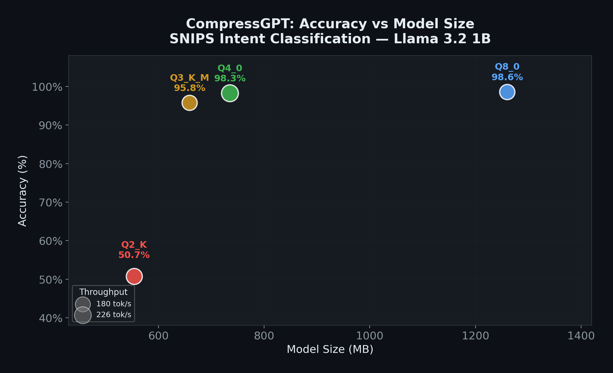
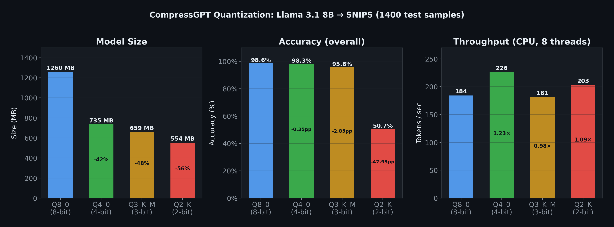

# compressGPT
[](https://pepy.tech/projects/compressgpt-core)

**compressGPT** is a flexible, modular training pipeline designed to bridge the gap between large foundation models and efficient edge-ready deployment.

It orchestrates the full lifecycle of Large Language Model (LLM) optimization from supervised fine-tuning, through post-quantization recovery, to production-ready artifact generation with a single, composable API.

Unlike rigid training scripts, compressGPT allows developers to define **custom compression workflows** by composing high-level stages such as `ft`, `compress_8bit`, and `deploy`. Whether you need a high-accuracy FP16 model for server inference or a compact GGUF Q8_0 model for CPU-only deployment, compressGPT automates tokenization, adapter training, memory-efficient evaluation, and artifact generation to deliver the **smallest runnable model that preserves task-level accuracy**.

> **Result:** From a Llama 3.2 1B model (~2.3 GB FP16), compressGPT produces a **735 MB Q4_0 GGUF** with **<0.4 pp accuracy loss** on SNIPS intent classification **98.3% accurate, 4.4 samples/sec on CPU**.  
>  
> The entire pipeline fine-tuning, 8-bit compression with recovery, and GGUF export **runs for free on Google Colab's T4 GPU** in under 40 minutes. The output is a single `.gguf` file you can deploy anywhere with [llama.cpp](https://github.com/ggerganov/llama.cpp) or [Ollama](https://ollama.com) no GPU required at inference time, predictable latency (~230 ms P50), and zero serving cost beyond the CPU itself.  
> Try it: [Open in Colab](https://colab.research.google.com/drive/1Bx3NxiSevrVxftdcBO5FF5tCKWKTozcv) · [Full benchmark](#-benchmark-snips-intent-classification-gguf-on-cpu)

---

## 🚀 Quick Start

To install:
```bash
pip install compressgpt-core
```

Below is a complete example that transforms a CSV dataset into a compressed, deployment-ready 4-bit Llama-3 model.

```python
from compressgpt import (
    CompressTrainer,
    DatasetBuilder,
    TrainingConfig,
    DeploymentConfig,
)

prompt_template = (
    'Classify this notification as "Important" or "Ignore".\n'
    'Important: Security alerts, direct messages, payment confirmations.\n'
    'Ignore: Marketing promos, news digests, social media likes.\n\n'
    'Notification: {text}\n'
    'Answer:'
)

MODEL_ID = "meta-llama/Llama-3.2-1B"

# Build dataset
builder = DatasetBuilder(
    data_path="notifications.csv",
    model_id=MODEL_ID,
    prompt_template=prompt_template,
    input_column_map={"text": "message_body"},
    label_column="label",
).build()

# Run compression pipeline
trainer = CompressTrainer(
    model_id=MODEL_ID,
    dataset_builder=builder,
    stages=["ft", "compress_8bit", "deploy"],
    training_config=TrainingConfig(
        num_train_epochs=1,
        eval_strategy="epoch",
        save_strategy="epoch",
    ),
    deployment_config=DeploymentConfig(
        save_merged_fp16=True,     # Canonical dense model
        save_gguf_q8_0=True,       # GGUF Q8_0 for llama.cpp/Ollama
    ),
)

results = trainer.run()

print("Training complete!")
print(results)
```

## 📦 Deployment & Artifacts

### Deployment Methods
The final stage of the pipeline, **`deploy`**, automatically converts your optimized model into production formats. Controlled by `DeploymentConfig`, it supports:

*   **GGUF Q8_0 (`save_gguf_q8_0`)**: The recommended format for **CPU/GPU inference**. These files can be loaded directly into [llama.cpp](https://github.com/ggerganov/llama.cpp), [Ollama](https://ollama.com), or [llama-cpp-python](https://github.com/abetlen/llama-cpp-python). Bundled conversion no external tools required.
*   **GGUF F16/BF16 (`save_gguf_f16`, `save_gguf_bf16`)**: Higher precision GGUF for maximum accuracy.
*   **Merged FP16 (`save_merged_fp16`)**: The canonical high-precision model. Use this for **vLLM / TGI servers** or further research.

> **Note:** GGUF conversion uses vendored code from [llama.cpp](https://github.com/ggml-org/llama.cpp) (MIT License). Currently supports F32, F16, BF16, and Q8_0 quantization. For other quantization types (Q4_K, Q5_K, etc.), use the external `llama-quantize` tool on the output.

### Saving Models & Trade-offs
A unique feature of compressGPT is that **every stage saves its own model and metrics**. This allows you to deploy different versions of the *same model* to different devices based on their constraints.

**1. Default Outputs (`runs/default/`)**
Every stage you run automatically saves its result:
*   `ft_adapter/`: High-accuracy LoRA adapter (best for Cloud/GPU).
*   `compress_8bit_merged/`: Quantized & recovered model (best for accuracy/size balance).
*   `metrics.json`: Compare `ft` vs `compress_8bit` accuracy to make data-driven deployment decisions.

**2. Deploy Outputs (`runs/default/deploy/`)**
Production-ready artifacts are generated here **only if enabled** in `DeploymentConfig`:

```text
runs/default/deploy/
├── merged_fp16/        # Universal format (vLLM, TGI)
└── gguf/
    └── model-q8_0.gguf # Optimized GGUF for llama.cpp/Ollama
```

---

## 📊 Benchmark: SNIPS Intent Classification (GGUF on CPU)

[](https://colab.research.google.com/drive/1Bx3NxiSevrVxftdcBO5FF5tCKWKTozcv)

The following results show the size/quality/performance trade-offs of advanced GGUF quantization levels on SNIPS (7-way intent classification, 1,400 test utterances).

**Setup**
- Inference: `llama-cpp-python` (greedy decode, `max_tokens=3`, `n_ctx=512`), CPU (8 threads).
- Quantizations: `Q8_0` produced by compressGPT's bundled GGUF converter; `Q4_0`, `Q3_K_M`, and `Q2_K` produced using the external `llama-quantize` tool (see note in Deployment section).
- Metrics:
  - `valid_rate`: fraction of samples where the model produced one of the allowed label words.
  - `valid_only_accuracy`: accuracy after filtering `INVALID_OUTPUT` samples (useful to isolate decision quality from output-formatting failures which can be resolved with retry).

| GGUF | Size (MB) | valid_rate | valid_only_accuracy | Samples/sec | P95 latency (ms) |
|---|---:|---:|---:|---:|---:|
| Q8_0 | 1259.9 | 99.86% | 98.78% | 3.55 | 608.3 |
| Q4_0 | 735.2 | 99.86% | 98.43% | 4.36 | 433.2 |
| Q3_K_M | 658.8 | 97.29% | 98.46% | 3.49 | 548.1 |
| Q2_K | 554.0 | 75.71% | 66.98% | 3.88 | 436.9 |

**Key takeaways**
- `Q4_0` is the best default for CPU inference here: fastest and high accuracy.
- `Q3_K_M` matches `Q4_0` on *valid-only* accuracy, but produces more invalid label strings under naive text parsing. If you need strict labels, prefer label-restricted scoring over free-text parsing.
- `Q2_K` shows a clear collapse in both `valid_rate` and accuracy.





> Cost proxy: the second chart reports **CPU seconds per 1k inferences**. Multiply by your CPU hourly rate to estimate $/1k.

## ⚠️ Current Support
Currently, compressGPT is optimized for **Classification Tasks** (e.g., Sentiment, Intent Detection, Spam Filtering). Support for Generation tasks (RAG, Chat) is coming soon.

## Notes on Development

This project was built quickly and iteratively while converting an academic thesis into a working system.
AI tools were used to accelerate implementation; all core ideas, abstractions, and evaluation logic come directly from my thesis and were reasoned about and validated manually.
